# SCCN Introduction to Modern Brain-Computer Interface Design

This respository shows the solutions for the exercises from the BCI course from SCCN. Please feel free to check out this very informative resource [here](https://sccn.ucsd.edu/wiki/Introduction_To_Modern_Brain-Computer_Interface_Design).

## Exercise 1

Implementation of an ERP-based BCI to detect error trials during a flanker task, where the subject is asked to press the left/right button based on the direction of the center arrow. The subject makes frequent errors (25%) becuase of the "flanker" arrows.

A windowed approach is used to extract features as the weighted average across channels during the following time windows (seconds): [0.25 0.3; 0.3 0.35; 0.35 0.4; 0.4 0.45; 0.45 0.5; 0.5 0.6].

The LDA classifer was used, which creates a linear mapping from the input to the output using the formula below.

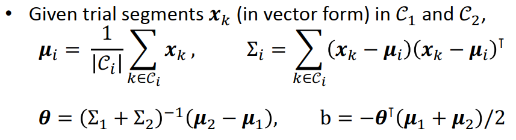
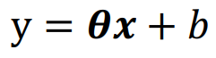

However, since we only have few available trials and our data has high dimensionality, this can make the covariance calculation unstable. To address this, we can apply shrinkage to regularize the estimator.

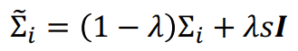

For classification, we simply apply the linear mapping and the sign of the result tells us which class the trial belongs to.

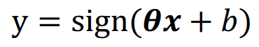

By applying the shrinkage LDA approach, we achieved a mis-classification rate of 8.06% on the test set.

## Exercise 2

### Phase 1

BCILAB implementation of the shrinkage LDA based classifier for the flanker task in Exercise 1.

| Train Results | Test Results |
| ------------- | ------------ |
|  |  |

To understand the the model, the model weights can be visualized as spatial filters:

While the previous analyses were performed offline, we can also adapt an online implementation to see how the model performs in real-time. The following plot shows the distribution of the probability for each class as the test data set is passed into the classifier in real-time. Class 1 corresponds to the non-error events, while class 2 corresponds to the error events. Here we can see that the classifier predicts a higher probability for the non-error events most of the time, and for the error events infrequently.

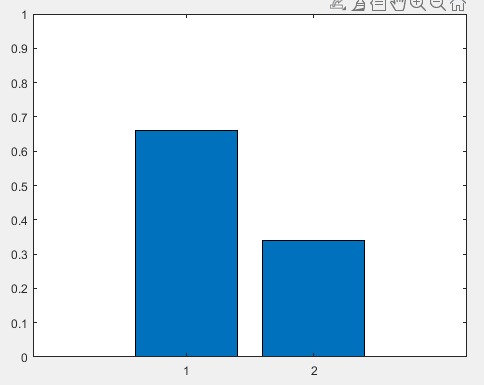

### Phase 2

Here, we create different variations of the basic BCI design by changing different parameters. Specifically, we tested different lambda values (0.1, 0.5, 1) for the shrinkage LDA classifier.

| Lambda Value | Train Results | Test Results |
| ------------ | ------------- | ------------ |
| 0.1          |  |  |
| 0.5          |  |  |
| 0.5          |    |    |

Based on the error rate of the testing set, we can see that a lambda value of 0.1 produced the best results among the different approaches.

## Exercise 3

Implementation of a CSP-based BCI to classify between imagined left- vs right-hand movemnets from the BCI competition IVb dataset. Each trial begins with 3 seconds of a visual cue of a letter (either L or R), followed by the imagery task, and ends with a blank screen for 3.5 seconds.

In this exercise, we try to detect Event-Related Synchronization / Desynchronization (ERS/D), which refers to the attenuation of motor idle rhythms during an event. In the following time-frequency plots, we can see an increase in power at around 10 Hz for left-hand (red) and right-hand (green) motor imagery. These would be captured in the input features to the BCI.

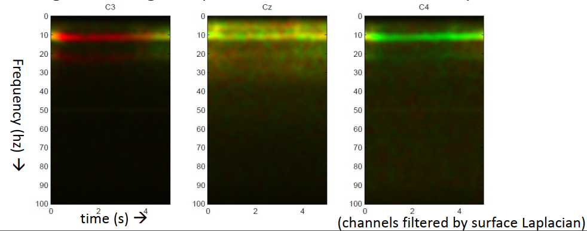
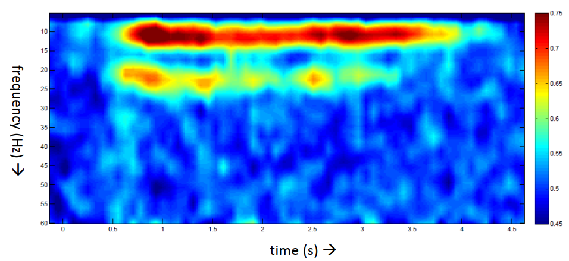

The Common Spatial Patterns (CSP) algorithm works by learning spatial filters that maximizes the variance of the filtered signal variance for one class and minimizes that of the other class. The spatial filters can be thought of as a transformation that projects the signal to a space where the variance of the classes are different.

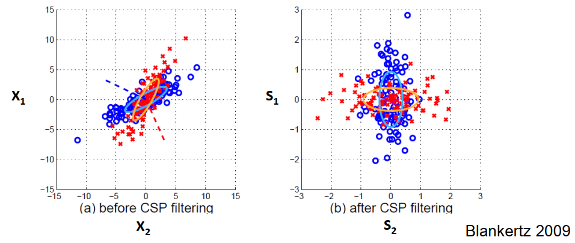

We can also visualize these filters by plotting them back to the electrode positions.

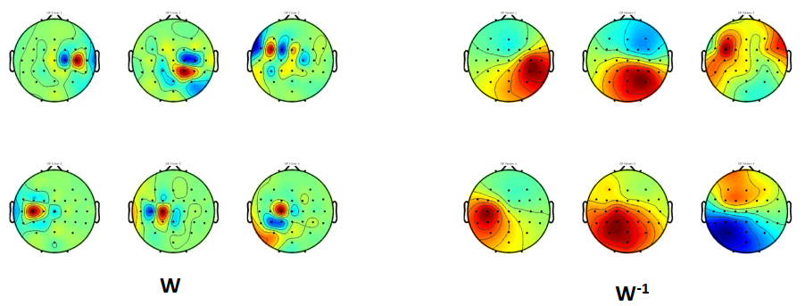

To use the CSP algorithm to learn spatial filters for the oscillatory processes, we assume the following:
1. Frequency band and time window are known
2. Band-passed signal is jointly Gaussian within the time window
3. Source activity constellation differs between two classes

By applying the generalized eigenvalue problem, we can solve for the spatial filters.

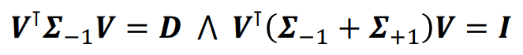

To make a prediction using the CSP approach, we essentially apply spatial filtering, calculate the log-variance, and apply a linear or non-linear classifier.

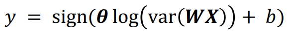

CSP-based BCIs typically operate on a band-pass filtered signal. For this exercise, we bandpass-filter our data from 7 to 30 Hz using an FIR filter.

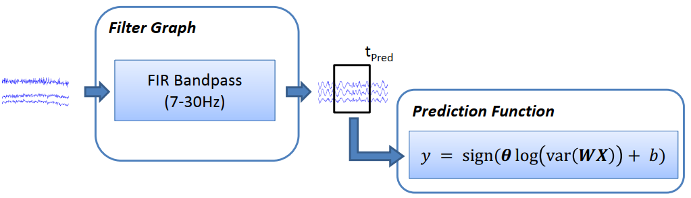

This can be implemented as a temporal filter, T, that is applied to the prediction function.

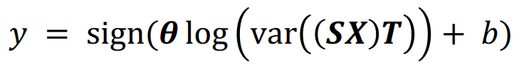

By applying the above, we obtain a mis-classification rate of 12.8% on the test set.

We can also apply the CSP prediction function to the test data in a real-time manner. In the plot below, We see the output of the CSP prediction function in blue, and the corresponding label in orange.

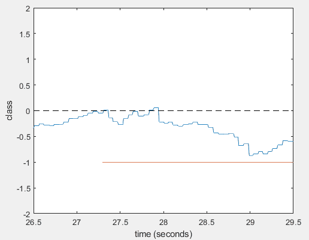

