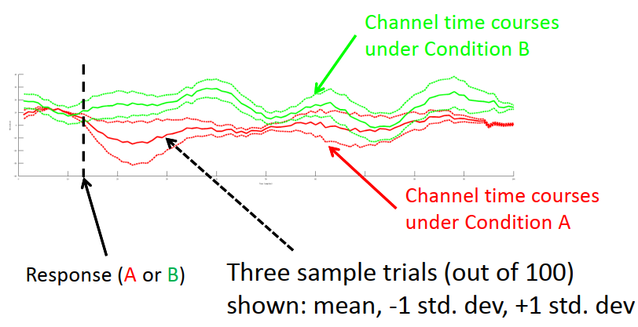
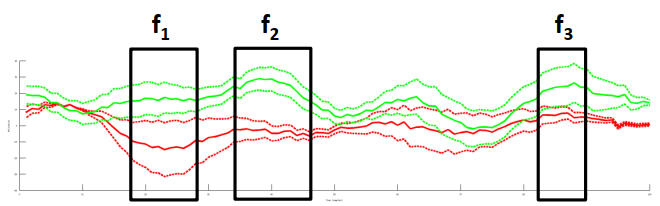
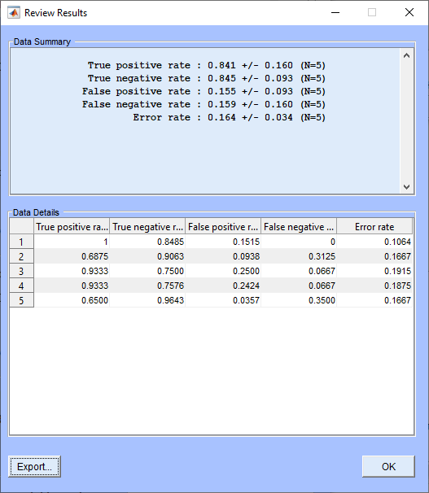
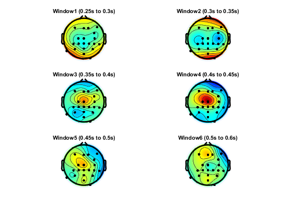
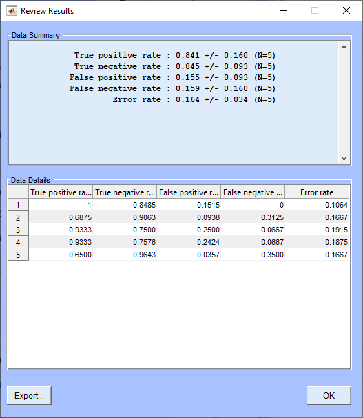
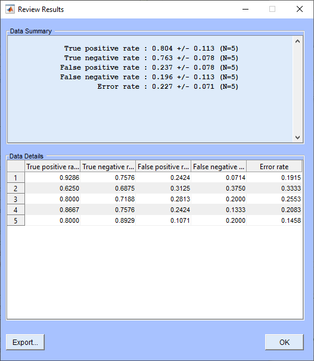
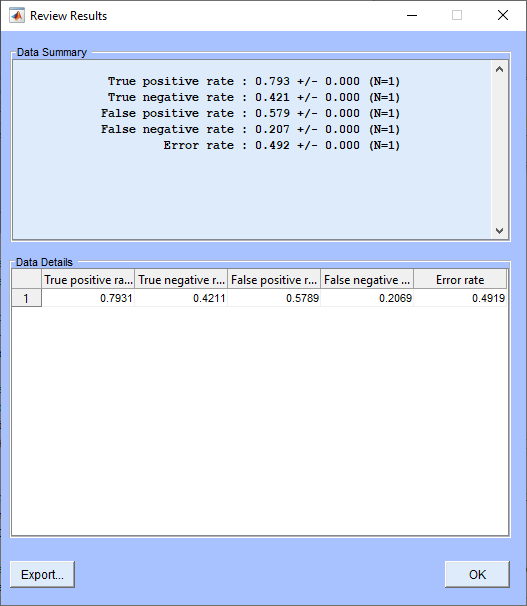

# SCCN Introduction to Modern Brain-Computer Interface Design

This respository shows the solutions for the exercises from the BCI course from SCCN. Please feel free to check out this very informative resource [here](https://sccn.ucsd.edu/wiki/Introduction_To_Modern_Brain-Computer_Interface_Design).

## Exercise 1

Implementation of an ERP-based BCI to detect error trials during a flanker task, where the subject is asked to press the left/right button based on the direction of the center arrow. The subject makes frequent errors (25%) becuase of the "flanker" arrows.

A windowed approach is used to extract features as the weighted average across channels during the following time windows (seconds): [0.25 0.3; 0.3 0.35; 0.35 0.4; 0.4 0.45; 0.45 0.5; 0.5 0.6].

By applying a shrinkage LDA classifier with a lambda of 0.1, a mis-classification rate of 8.06% was achieved on the test set.

## Exercise 2

### Phase 1

BCILAB implementation of the shrinkage LDA based classifier for the flanker task in Exercise 1.

| Train Results | Test Results |
| ------------- | ------------ |
|  |  |

To understand the the model, the model weights can be visualized as spatial filters:

While the previous analyses were performed offline, we can also adapt an online implementation to see how the model performs in real-time. The following plot shows the distribution of the probability for each class as the test data set is passed into the classifier in real-time. Class 1 corresponds to the non-error events, while class 2 corresponds to the error events. Here we can see that the classifier predicts a higher probability for the non-error events most of the time, and for the error events infrequently.

### Phase 2

Here, we create different variations of the basic BCI design by changing different parameters. Specifically, we tested different lambda values (0.1, 0.5, 1) for the shrinkage LDA classifier.

| Lambda Value | Train Results | Test Results |
| ------------ | ------------- | ------------ |
| 0.1          |  |  |
| 0.5          |  |  |
| 0.5          |    |    |

Based on the error rate of the testing set, we can see that a lambda value of 0.1 produced the best results among the different approaches.

